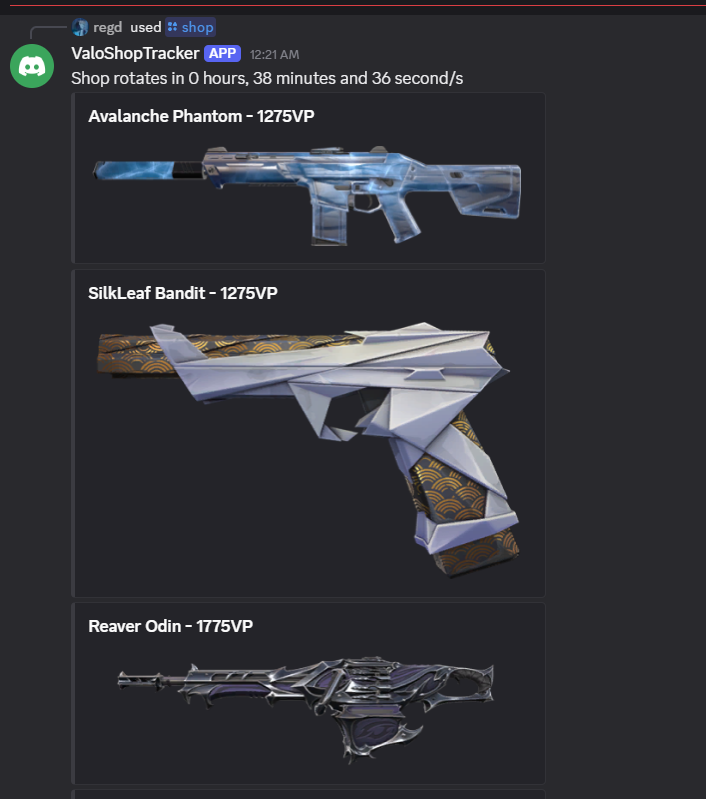

# ValoShopTracker

A Discord bot that fetches your daily Valorant shop rotation.



## How it works

Riot does not have a public supported API for fetching account details like daily shop. This bot calls community found endpoints for both authentication and daily shop.

**Auth flow**
1. **/login** generates a Riot OAuth2 authorization URL.
2. You log in through that URL, it throws an error, the user copies the new URL and pastes it into the bot.
3. The bot uses that code at **auth.riotgames.com/token** for an access token & refresh token (valid for ~3 weeks).
4. The access token is used to fetch entitlement info and player info (PUUID, shard) from Riot, which gets stored in the database.
5. From then on, the bot uses the stored refresh token to get new access tokens until that token expires

**Fetching the shop**:
The bot uses the access + entitlement tokens to hit Riot's storefront endpoint, then resolves the returned skin IDs into readable names/images via the community maintained api [valorant-api.com](https://valorant-api.com).

## Security

- Refresh tokens are encrypted at rest using **AES-256-GCM** before being stored in the database (ciphertext, nonce, and auth tag stored separately).
- Access tokens are stored in plaintext as they're short lived (1 hour).
- The bot never touches a user's password as it uses tokens.


## Features
 
- `/login` - Log in with a Riot account. Generates a login link, then accepts the resulting redirect URL to complete authentication.
- `/shop` - Fetches the daily shop rotation for your **currently selected** account.
- `/view-accounts` - Lists all Riot accounts linked to your Discord account, with the IDs used by other commands.
- `/select-account <id>` - Switches your active/selected account (for users with multiple linked accounts).
- `/delete-account <id>` - Removes a linked account and its stored credentials from the database.

## Setup

### Requirements
- .NET SDK
- A Discord bot application + token ([Discord Developer Portal](https://discord.com/developers/applications))
- SQLite

### Configuration

**`appsettings.json`**
```json
{
  "Token": "your-discord-bot-token",
  "GuildId": "your-discord-server-id-for-debugging"
}
```

**`keys.env`**
```
AES_KEY=your-32-byte-base64-encoded-key
```
Generate a key with:
```csharp
Console.WriteLine(Convert.ToBase64String(RandomNumberGenerator.GetBytes(32)));
```

### Database
Apply EF Core migrations to create `ValoShopTracker.db`:
```bash
dotnet ef database update
```

### Run
```bash
dotnet run
```

##  Important notes

- This project uses a unsupported, undocumented API. It can break at any time if Riot changes their auth flow, endpoint versions or headers.
- `X-Riot-ClientPlatform` is currently hardcoded and may need updating if Riot changes it, check community resources like [valorant-api.com](https://valorant-api.com) or the Valorant API Discord for current values.
- `X-Riot-ClientVersion` is fetched dynamically from a third-party API and depends on that service staying available.
- This is an unofficial project, not affiliated with or endorsed by Riot Games.
